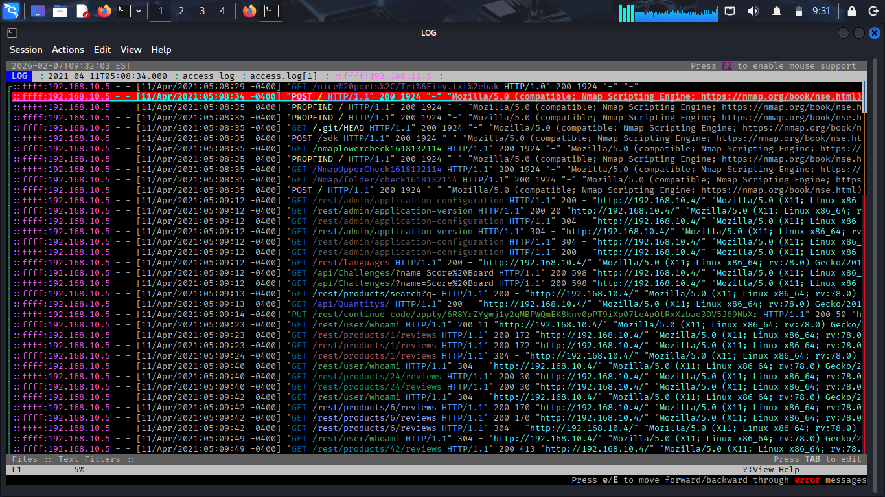
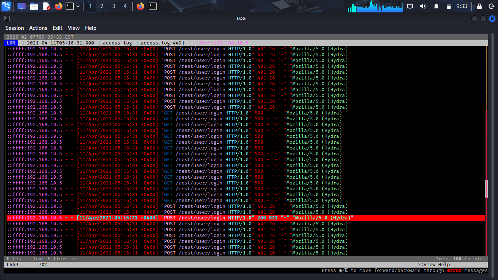
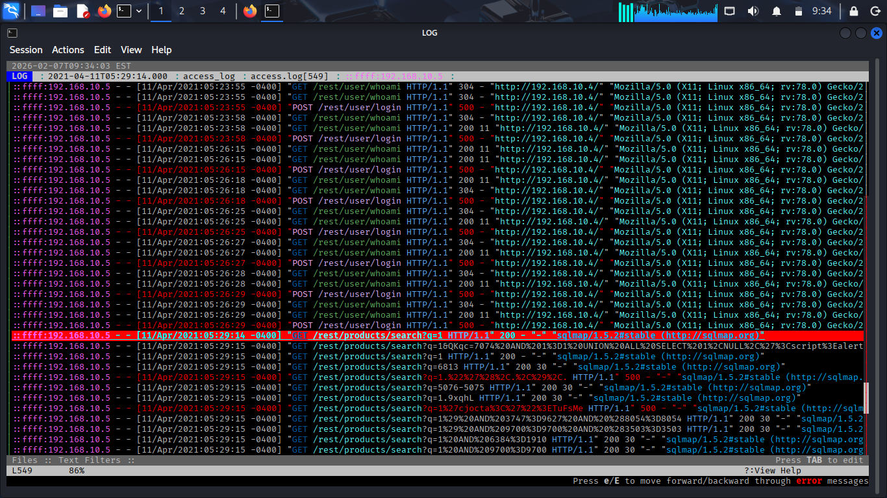
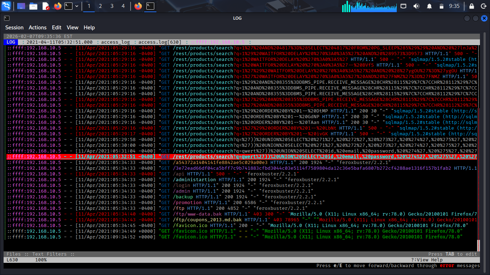
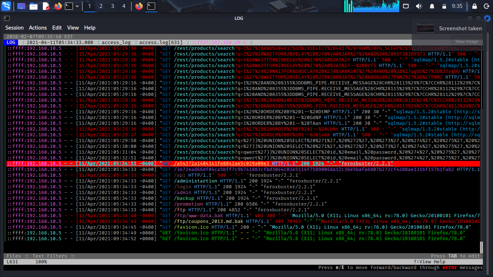
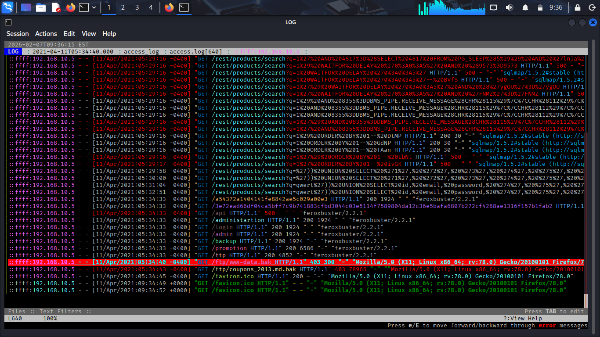
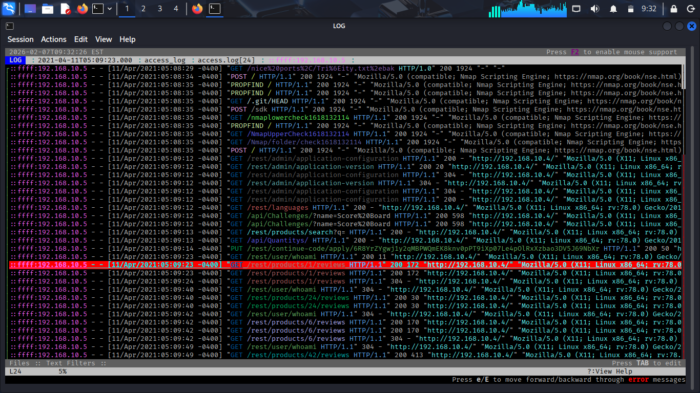
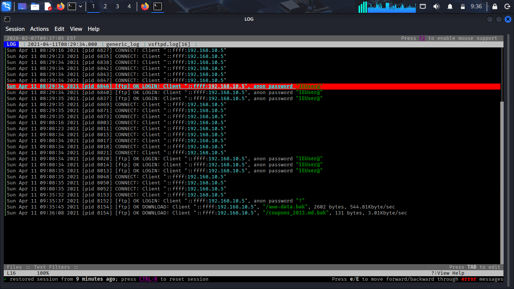
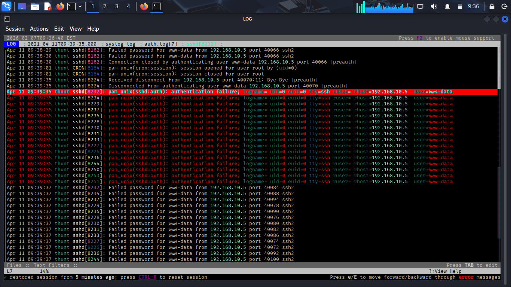

TryHackMe: Juicy Details Writeup 🛡️

Introduction

This room simulates a real-world web application attack. As a SOC Analyst, the goal is to perform log analysis to reconstruct the attack lifecycle, identify the tools used, and understand the impact of the breach.

Analysis Tool: Lognav

To efficiently navigate and filter through large log files, I used Lognav, a terminal-based log file navigator that provides a clean interface for searching and analyzing events.

Installation:

sudo apt install lnav # Often referred to as lognav/lnav

Task 1: Tracking the Attacker's Footprints
During the initial phase, the attacker performed reconnaissance and attempted several exploitation techniques:

Tools Identification:

Nmap (Line 1): Used for initial network scanning and information gathering.

Hydra (Line 207): Employed for a brute-force attack against login forms.

SQLmap (Line 549): An automated tool used to detect and exploit SQL injection vulnerabilities.

Curl (Line 630): Used to send manual HTTP requests and interact with specific endpoints.

Feroxbuster (Line 631): Used for recursive directory discovery (fuzzing) to find hidden files.

Brute-force Point:
The attacker targeted the login endpoint /rest/user/login, as seen on Line 207.

SQLi Vulnerability:
A SQL Injection vulnerability was identified at the /rest/products/search endpoint (Line 549).

Vulnerable Parameter:
The attacker exploited the q parameter on Line 549 to inject SQL commands.

Sensitive File Access:
An attempt to access the backup file /ftp/www-data.bak was logged on Line 639.

Task 2: Analyzing the Impact (Deep Dive)
A deeper look into the logs reveals the extent of the data breach and unauthorized access:

Data Scraping:
On Line 24, the attacker scraped user email addresses from the product reviews section.

Successful Login:
The brute-force attack succeeded on Line 449 at 11/Apr/2021:09:16:31 +0000.

Data Theft:
Using SQL injection, the attacker successfully retrieved sensitive email and password data (Line 629).

FTP Activity (vsftpd.log):

On Lines 36 & 37, the attacker attempted to download www-data.bak and coupons_2013.md.bak.

Line 28 shows the FTP service was misconfigured to allow anonymous login.

Remote Access (auth.log):

On Line 7, the attacker gained full shell access via SSH using the www-data account.

🚩 SOC Incident Report (Executive Summary)
Subject: Incident Report - Web Server Compromise

Detection: Log analysis identified a multi-stage attack starting from reconnaissance to full system compromise.

Vulnerabilities Exploited:

Broken Authentication: Lack of rate limiting on the /login endpoint.

SQL Injection: Unsanitized input in the search functionality.

Insecure Service Configuration: Anonymous FTP access enabled.

Impact: Unauthorized access to user credentials and full remote shell access (SSH) as www-data.

Recommendations:

Implement input validation and parameterized queries for the q parameter.

Disable anonymous FTP access and enforce strong authentication.

Implement account lockout policies or CAPTCHAs to prevent brute-force attacks.
Writeup by Ismail/The-captive-king-SOC
